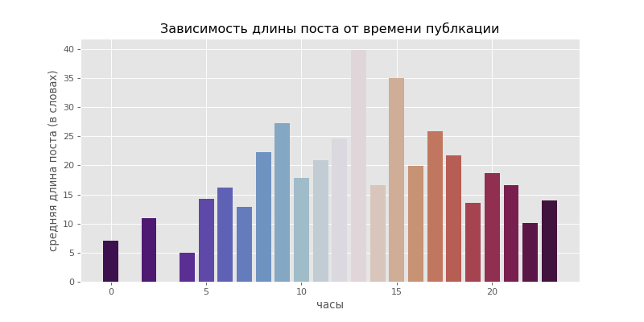

файлы с текстами лежат [тут](https://drive.google.com/drive/folders/1V2kfI8to7C7xfRR-y3cGiCipLd8Gtetn?usp=sharing)

тхт с текстами, тхт с лемм. такстами и БД со постами и комментариями (plain и лемм.)

БД продублирована в репозитории ([вот она](corpus_db.db))
еще есть файл json с теми же данными

## Вот красивый график просто так

